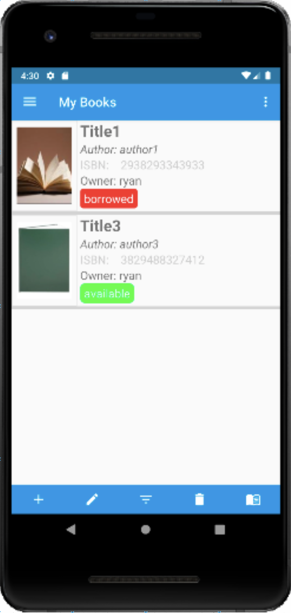
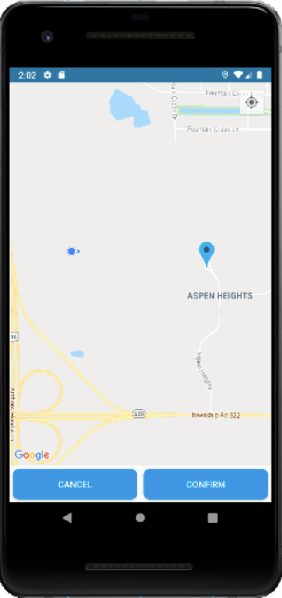
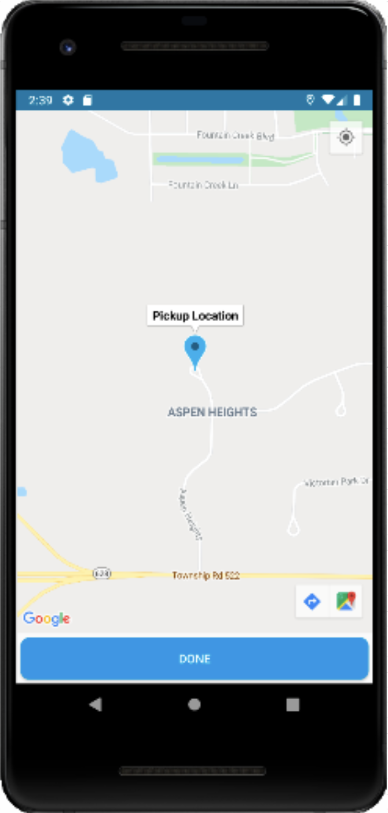

# Book Tracker 

An android application for tracking book sharing.  

Add books to your collection for other users to find and borrow. 

Book Tracker uses the Firebase Cloud Firestore database to make updates in real time. Users can search for a book using a keyword in relation to the title, author or description and send a request to the original owner to either accept or decline the borrow request.

The app implements Google Maps API to set a location to receive a book. Google Books API allowing users to scan books that are in the Google Books database and add them to their virtual book collection.

Check out the [wiki](https://github.com/CMPUT301F20T11/Cloud8/wiki) for a more in depth look into our application.

### Meet The Team:
<table>
   <tr>
       <td></td>
       <td></td>
<td></td>
<td></td>
<td></td>
<td></td>
   </tr>
   <tr>
        <td>Ahmad Amali</td>
	<td>Andrew Wood</td>
	<td>Edlee Ducay</td>
	<td>Ivan Penales</td>
	<td>Ryan Moro</td>
	<td>ZiQing Ma</td>
    </tr>
<tr>
</table>

	
	
	
	
	
	
	
	
	
	
	
	
	
	
	
	
	
	
	
	

## License
[MIT License](https://github.com/CMPUT301F20T11/Cloud8/blob/master/LICENSE)
